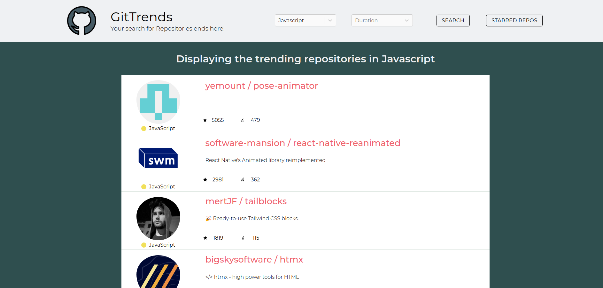
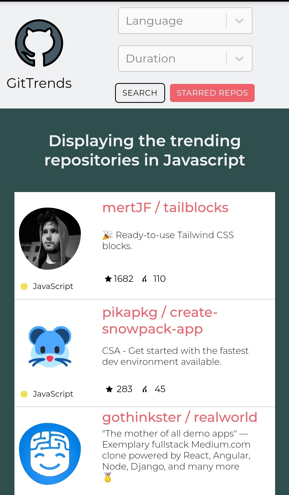
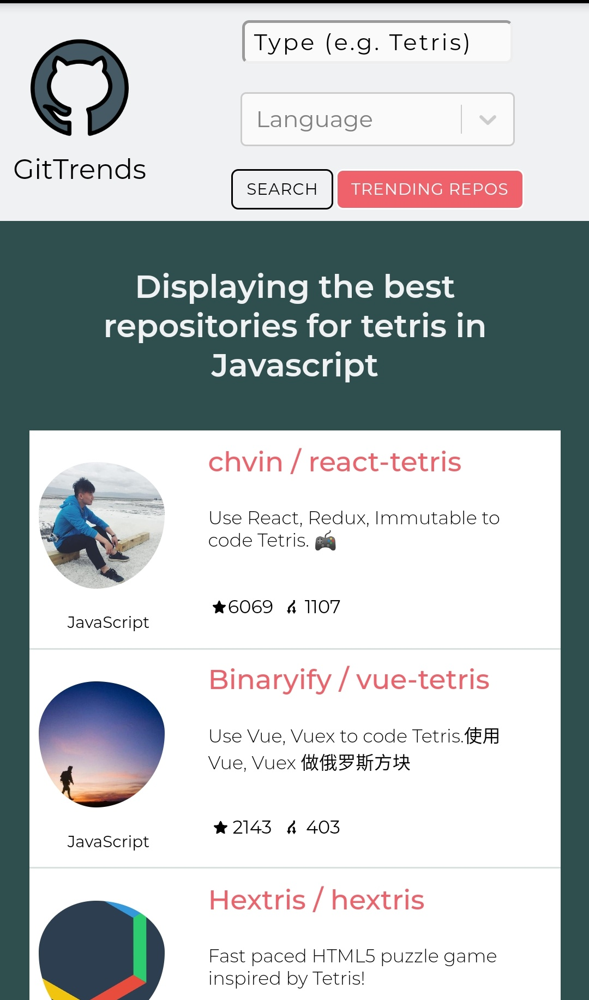

# GitTrend
Your search for repositories ends here!

Look out for the trending repositories on github. You can also apply filters to see the trending repositories in a particular 
programming language and also specify the duration.

You can also search for particular repositories in a certain language. E.g. You can search for all the famous repositories of
tetris in javascript!

### Deployed: https://gittrends.netlify.com/

### Web View:

### Mobile View:

  
